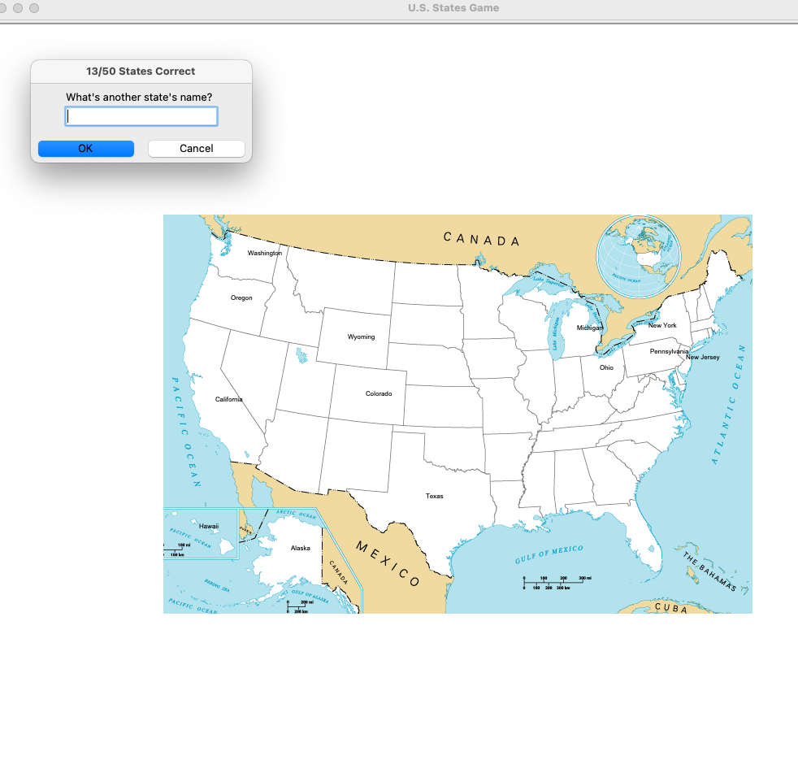

# US States Game

Guess all the 50 states in the USA. 

Your score is tracked on the prompt. The user can type in the name in the prompt dialog box.
The input is case-insensitive.
## Usage:
Run `main.py`

It uses `50_states.csv` to get the names of the states and their approximate locations on the screen.

Type "Exit" if you want to end the game.

This will save the states you missed in `states_to_learn.csv`

### Pandas
It is one of the most popular Python data analysis library. The two primary data structures of pandas, 
Series (1-dimensional) and DataFrame (2-dimensional), handle the vast majority of typical use cases in finance, 
statistics, social science, and many areas of engineering

### CSV
CSVs are a very common way of representing tabular data, so data that fits into tables like a spreadsheet.

_Keywords: csv data, Pandas library_
